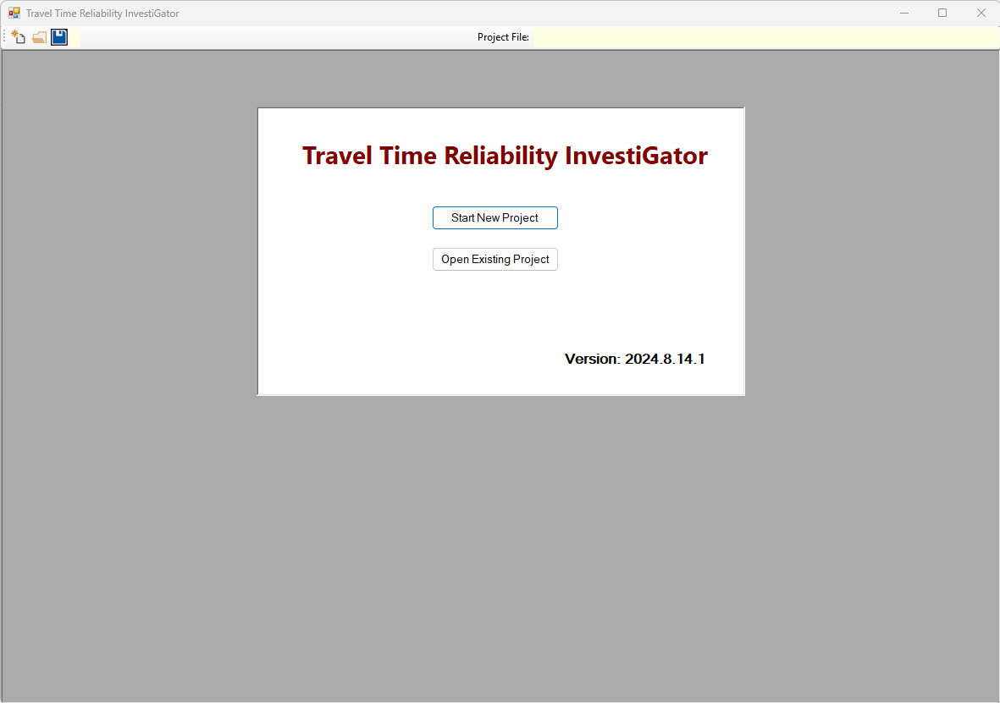
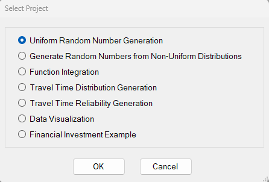

# Monte-Carlo-Simulation
This software tool is intended to help transportation engineers gain an understanding of the stochastic/probabilistic fundamentals involved in a travel time reliability analysis. It complements the manual on Fundamentals of Travel Time Reliability (citation below). The document is available at (add link to publication website). 

Fundamentals of Travel Time Reliability
Publication No. FHWA-xx-yy, Month, Year
U.S. Department of Transportation
Federal Highway Administration

Appendix D (Monte Carlo/TTR Instructional Software Tool) of this document provides interactive examples for the software tool. Questions about the software should be referred to <a href="https://faculty.eng.ufl.edu/scott-washburn/">Dr. Scott Washburn</a>.

## Getting Started

On the right side of this screen, select the <a href=https://github.com/swash17/Monte-Carlo-Simulation/releases">Releases label</a>. From the Releases page, download the latest release package to any folder on your computer. This package consists of the file 'TTREducationInstall.msi'. Run this file and install to either the default folder (C:\Program Files\SwashWare\TTR Education) or a different folder of your choosing. The 'TTREducationInstall.msi' file can be deleted once the installation is complete. Alternatively, you can run it again to uninstall the program. Uninstalling the program can also be accomplished through the Windows Control Panel.

The TTR Education program only runs on the Windows operating system. You also need version 4.8, or higher, of the .NET Framework Runtime installed on your computer. The installation process should give you a warning if you do not have the required version of the .NET Framework Runtime and give you an option to download and install it from Microsoft's website. But if you have any problem starting the program after installation, this should be the first thing to check.  You can check which version of the .NET Framework you have installed from the Programs and Features section of the Control Panel.  If needed, you can download the latest version, for free, from <a href="https://dotnet.microsoft.com/en-us/download/dotnet-framework/net48">.NET Framework Runtime download link</a>.

After the program is installed, you can launch it by selecting the TTReducation.exe file or selecting the program icon from the Windows Start menu or the desktop.

When the program starts, you will see the following screen.

You can either start a new project or open an existing project file. Selecting the 'Start New Project' option will present the following available project types.

After a project type has been loaded, you can also load a corresponding project data file from that screen.

The following table lists the file extensions associated with each project type. Some modules do not provide an option to save project settings; thus, 'Not Applicable' for the file extension.

| Project Type | File Extension |
|--------------|----------------|
| Uniform Random Number Generation | Not Applicable |
| Non-Uniform Random Number Generation | ttrrand |
| Function Integration | ttrint |
| Travel Time Distribution Generation | ttrtrip |
| Travel Time Reliability Generation | ttrhcm |
| Data Visualization | Not Applicable |
| Financial Investment Example | ttrfin |

 Appendix D of the Fundamentals of Travel Time Reliability document describes how to use each of these project types (also referred to as modules), except for the Financial Investment Example module. 
 
 A few example files are included in the installation--those files start with 'Example' in the filename. 
 
 There are also two example files (ExampleTravelTimeData1Seg.csv, ExampleTravelTimeData4Segs.csv) included that contain travel time data for use with the 'Travel Time Distribution Generation' module. These files have a 'csv' filename extension. If the 'Distribution Type' for a segment is set to 'Data', rather than a probability distribution (Normal, Log-Normal, Uniform), the data file can be loaded by pressing the 'Upload' button under the 'Data' column. For a data file containing travel times for more than one segment (e.g., ExampleTravelTimeData4Segs.csv), use the 'Upload Travel Time Data' button. Saving a project file from this module will save all data.
 
 Another example data file is included (ExampleVisualizationTTRdata.csv) for use with the 'Data Visualization' module. This file is also loaded from within the module by pressing the 'Load Data' button.

 The example files are installed with the program files in the installation directory. If you encounter an error loading an example file, it is likely due to permissions for accessing the installation folder. In that case, just move the example files to a location where your user account has read/write file permissions.